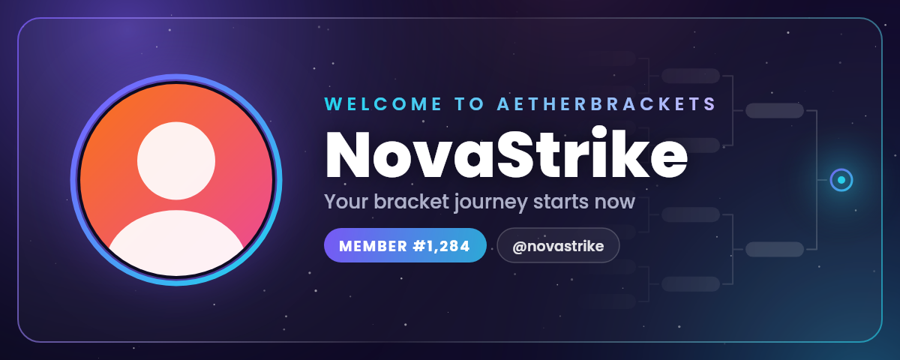

# AetherBrackets Bot

A custom Discord bot for **AetherBrackets**, built with **discord.js v14** and Discord's newest message layouts (**Components V2**: cards, sections, galleries).

| Feature | What you get |
|---|---|
| 🎛️ **Button roles** | Modern role panels in 3 styles (list cards · button grid · dropdown), 3 modes (toggle · one-at-a-time · add-only), per-role emoji/description/colour, banners, and a private **“My roles”** manager for every member |
| 😀 **Reaction roles** | Bot panels that list their roles automatically, or reaction roles on **any** existing message. Modes: normal · one-at-a-time · verify |
| ✨ **Auto reactions** | Pick a channel and up to **20 of your server emojis**: the bot reacts to **every new message** there (members, other bots, webhooks, and its own announcements and welcomes), always in your order |
| 📋 **Emoji templates** | Set your emojis once and put them on **many channels at once**: pick channels, whole categories, or all chat channels. Edit a template and every channel using it updates. Or just copy one channel's emojis to others |
| 😀 **React to any message** | `/react` with a message ID or link, or right-click → **Apps → React as Bot**. Emojis are picked from a **clickable list** of your server's emojis (animated ones too, no Nitro needed) |
| 📢 **Announcements** | Official posts under the bot's name: a big composer (2 × 4,000 characters, auto-split), up to **10 attachments**, ping @everyone/@here/roles, card or plain style, private **preview** before publishing, edit after posting, “Post as Announcement” from any draft message |
| 👋 **Welcome** | Generated **image banner** (avatar, name, member #) **or** a clean text card — switch any time — plus Rules/Roles buttons, auto-role and custom backgrounds |
| 🗂️ **Server IDs** | `/ids` lists **every category, channel and role with its ID** in sidebar order (private channels marked 🔒), privately and page by page, plus a `.txt` file with everything |

<p align="center"></p>

👉 Open **`docs/previews/ui-preview.html`** in your browser to see every panel and message the bot sends.

---

## 🚀 Quick start

1. **Create the bot** in the Discord Developer Portal, copy its **token** and turn on **Server Members Intent**. → [details](docs/1-setup-guide.md#1-create-the-bot-in-discord)
2. **Upload this folder** to a private GitHub repository. → [details](docs/1-setup-guide.md#2-put-the-code-on-github)
3. **Deploy on Railway:** Deploy from GitHub repo → **+ New → Database → MongoDB** → on the bot service add `DISCORD_TOKEN` and `MONGODB_URI=${{MongoDB.MONGO_URL}}`. → [details](docs/1-setup-guide.md#3-deploy-on-railway)
4. **Invite the bot** with the link from the logs, then drag its role **above** the roles it should give. → [details](docs/1-setup-guide.md#4-invite-the-bot--fix-the-role-order)
5. Type **`/help`** in your server. 🎉

> 🔒 Never share or upload your bot token. It belongs only in Railway's **Variables** (or a local `.env` file, which is git-ignored).

## 📚 Guides

| Guide | What's inside |
|---|---|
| [1 · Setup guide](docs/1-setup-guide.md) | Create the bot, upload to GitHub, deploy on Railway, invite it, role order, who can use the commands |
| [2 · Using the bot](docs/2-using-the-bot.md) | Every command for button roles, reaction roles, auto reactions, announcements, welcome and server IDs |
| [3 · Hosting & settings](docs/3-hosting-and-settings.md) | Environment variables, the Railway MongoDB database, Render & other hosts, running on your PC |
| [4 · Troubleshooting](docs/4-troubleshooting.md) | Fixes for common problems |
| [5 · Developer guide](docs/5-developer-guide.md) | Code map, how it fits together, tests, regenerating the previews |

## ⌨️ Commands at a glance

| Command | Default access | What it does |
|---|---|---|
| `/buttonroles` | Manage Roles | `create` · `add` · `remove` · `edit` · `repost` · `delete` · `list` |
| `/reactionroles` | Manage Roles | `create` · `add` · `remove` · `mode` · `clear` · `list` |
| `/autoreact` | Manage Server | `set` · `add` · `remove` · `list`: your emojis on every new message in a channel (leave `emojis` empty to pick from a list) · `copy` and `template create` · `apply` · `edit` · `delete` · `list`: the same emojis on many channels at once |
| `/react` | Manage Server | The bot reacts to any message: give its ID or link, then tick emojis in a list |
| `/announce` | Manage Server | Compose an official post: preview, ping, up to 10 attachments |
| `/welcome` | Manage Server | `setup` · `message` · `image` · `buttons` · `autorole` · `toggle` · `test` · `settings` |
| `/ids` | Manage Server | Every category, channel and role with its ID (private, paged, plus a .txt file) |
| `/help` | Everyone | Clickable overview of the bot |
| Right-click a message → **Apps** → **Post as Announcement** / **Edit Announcement** | Manage Server | Turn a draft into an official post, or edit a posted one |
| Right-click a message → **Apps** → **React as Bot** | Manage Server | Tick emojis in a list and the bot reacts to that message |

Access can be changed per role in **Server Settings → Integrations → AetherBrackets**.

## 🗂️ What's in this folder

```
aetherbrackets-bot/
├── README.md                 ← you are here
├── docs/                     ← guides + previews
│   ├── 1-setup-guide.md
│   ├── 2-using-the-bot.md
│   ├── 3-hosting-and-settings.md
│   ├── 4-troubleshooting.md
│   ├── 5-developer-guide.md
│   └── previews/             ← ui-preview.html (open in a browser) + welcome-card.png
├── src/                      ← the bot's code
│   ├── index.js              ← starts the bot
│   ├── commands.js · interactions.js · config.js
│   ├── features/             ← buttonRoles · reactionRoles · autoReact · reactPicker · announcements · welcome · serverIds · help
│   └── lib/                  ← storage, UI helpers, banner renderer, utilities
├── assets/fonts/             ← fonts for the welcome banner
├── tests/                    ← automated checks (npm test)
├── tools/                    ← preview generator (npm run preview)
├── .env.example              ← settings template
├── Dockerfile                ← how Railway builds the bot
├── package.json              ← dependencies + npm scripts
├── package-lock.json         ← exact dependency versions
├── .gitignore                ← keeps node_modules, .env and data out of GitHub
└── .dockerignore             ← keeps docs/tests out of the server image
```

---
Fonts: Poppins and Noto Sans, © their authors, SIL Open Font License (see `assets/fonts/OFL-*.txt`).
